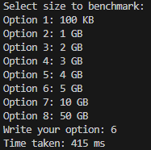

# Disk Benchmark
> C# CLI program for benchmarking disk

This is a simple CLI program made in C# for testing the write speed of your disk.

## How to use
Run the program by using `dotnet run`, you will then be prompted a few options to chose between.
Then type the number of the option into your console and hit `enter`.

Example:

